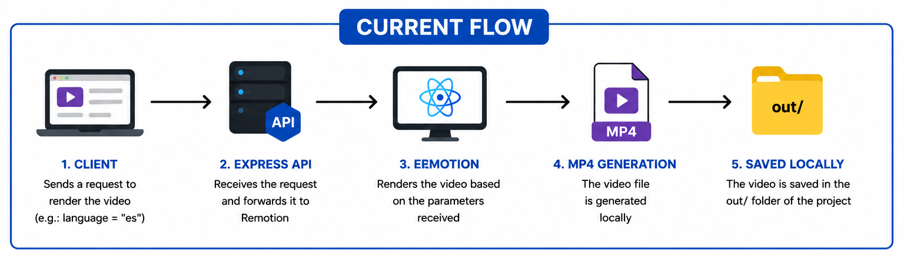
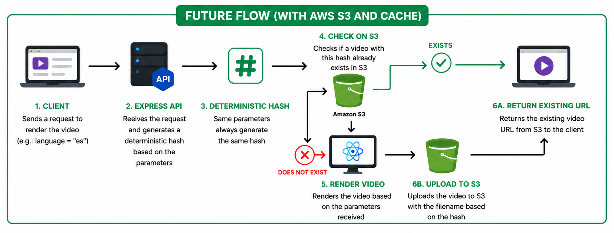

# Render Engine


This project explores the idea of treating videos as software components.

Instead of editing timelines manually, videos become:

- component based
- reusable
- multilingual
- scalable
- code driven

The long-term goal is to build a rendering pipeline capable of generating thousands of multilingual videos programmatically.

## Current Architecture

The project currently works as a rendering service.



The API receives the language as a parameter. The service renders the video and saves the generated MP4 file inside the `out/` folder.

## Commands Getting Started

### Install Dependencies

```console
npm install
```

### Start Preview with Remotion Studio

```console
npm run dev
```

### Render Video with Language as Parameter

```console
npx remotion render BoyWave out/pt.mp4 --props='{"language":"pt"}'
```

### External Requests

```console
npm run dev:server
```

```curl
curl -X POST http://localhost:3000/render \
-H "Content-Type: application/json" \
-d '{"language":"es"}'
```

### Upgrade Remotion

(If needed)

```console
npx remotion upgrade
```

## Planned Production Architecture

The planned production architecture includes:

- AWS S3
- deterministic hashing (based on business rules)
- render caching
- video reuse
- CDN delivery (Content Delivery Network)



## Docs

Get started with Remotion by reading the [fundamentals page](https://www.remotion.dev/docs/the-fundamentals).

## Help

We provide help on our [Discord server](https://discord.gg/6VzzNDwUwV).

## Issues

Found an issue with Remotion? [File an issue here](https://github.com/remotion-dev/remotion/issues/new).

## License

Note that some use cases may require a company license. [Read the terms here](https://github.com/remotion-dev/remotion/blob/main/LICENSE.md).